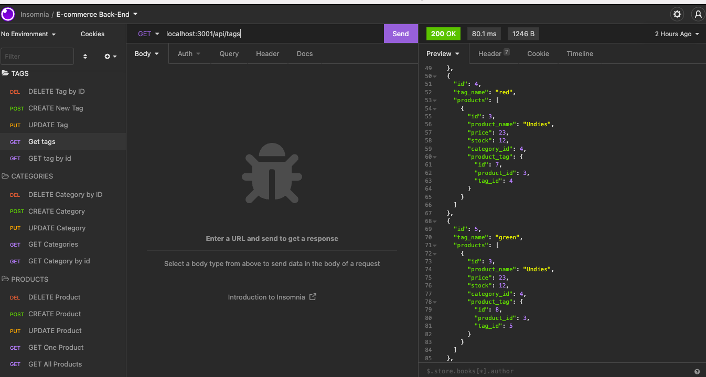

# e-commerce-tech

## Description

I built this application to build the back end for an e-commerce site. This application created a back end for a retail company manager for an e-commerce website. It uses the latest techonologies and can successfully create, update, and delete data within the database. I built this project to help create the back-end and help the company be more competitive to other e-commerce websites. I learnt a lot about API POST, GET, PUT, and DELETE routes building this application. I had to make sure the Sequelize models were synced properly and the routes were formatted and written correctly. This application is very successful and completes all of the acceptance criteria.

## Installation

First run cp .ed.ENV ed and input your username and password in the file.
Run npm i to install all packages.
Run npm i mysql2.
run npm seed to seed the database from the command line.
Then, run npm start to start the application's server.

## Usage

Screenshot of routes in Insomnia:

## Credits

GitHub: https://github.com/fcarroll12/e-commerce-tech
Walkthrough Video: https://drive.google.com/file/d/1ygHpCANuh06bA3W69kg8dZh3_m07FWtA/view?usp=sharing
